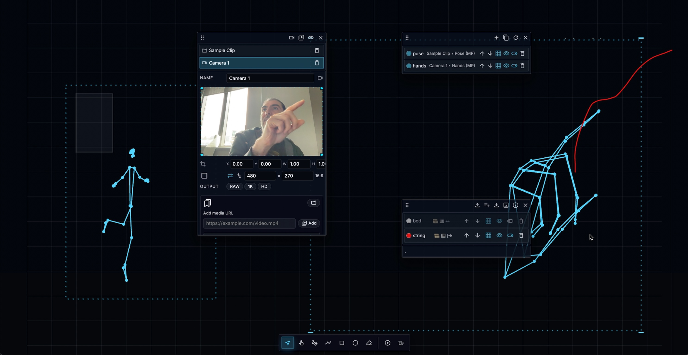

# Mediamime

Mediamime lets you draw shapes over a live camera feed and map every shape to MIDI messages—no installs, servers, or extra tooling required.

## Quick Start

Choose the path that matches how you received Mediamime:

### Option A – You downloaded the packaged single file (recommended for students)

1. Grab the latest `mediamime-<version>.zip` from the GitHub Releases page or from your instructor.
2. Unzip the archive and open the folder.
3. Double-click `index.html`.
4. Approve the MIDI and camera prompt so the preview has a live source. Add local videos or URLs later from the **Streams** panel if needed.

### Option B – You cloned/downloaded the source repository

The repository version references multiple modules, so opening it directly from `file://` may be blocked by your browser. Use one of these approaches:

1. **Serve the folder:** run `npx serve .` (or any static file server) and open the reported `http://localhost` URL.
2. **Package the single file yourself:**
	- Install Node.js 18 or later.
	- Run `npm install` once.
	- Run `npm run package:single` to produce `dist/mediamime-<version>.zip` (and `build/index.html`). Double-click the generated `index.html` or share the zip with others.

More detail lives in `docs/DISTRIBUTION.md`.

### Hosted on GitHub Pages (single-file build)

This repo is set up to publish the standalone build via GitHub Pages using Actions—no `docs/` folder needed:

- On pushes to `main`, GitHub Actions builds `build/index.html` and deploys it to Pages.
- Visit: https://languel.github.io/mediamime/

If Pages isn’t enabled yet: in the repo Settings → Pages, set “Source” to “GitHub Actions” and the workflow in `.github/workflows/deploy-pages.yml` will publish automatically.

## Keyboard Shortcuts

| Context | Shortcut | Action |
| ------- | -------- | ------ |
| Global | `Cmd/Ctrl + Z` | Undo the last change |
| Global | `Cmd/Ctrl + Shift + Z` | Redo |
| Global | `Cmd/Ctrl + Enter` | Toggle between Edit and Perform modes |
| Global | `Cmd/Ctrl + E` | Show/Hide the drawing toolbar |
| Panels | `Cmd/Ctrl + I / P / L / M` | Toggle Input, Preview, Layers, or Map panels |
| Panels | `Shift + Esc` | Close the most recently focused panel |
| Navigation | Hold `Space` + drag | Temporary pan with any tool |
| Navigation | `+` or `=` / `-` or `_` / `0` | Zoom in, zoom out, or reset zoom |
| Navigation | `F` / `Shift + F` | Frame the selection or frame all shapes |
| Drawing | `V`, `H`, `D`, `L`, `R`, `O`, `E` | Select, Hand/Pan, Freehand, Line, Rectangle, Ellipse, or Eraser tools |
| Drawing | `Q` | Toggle tool lock (keep the current tool active) |
| Drawing | Hold `Shift` | Snap to the 50px grid while drawing or moving points |
| Drawing | Hold `Cmd/Ctrl` | Snap to nearby shape vertices while drawing |
| Drawing | `Alt + Click` on a curve point | Remove the point (curve edit mode) |
| Editing | `Fn + Delete` (macOS) / `Delete` (Windows/Linux) | Remove selected shapes |
| Editing | `Esc` | Cancel the current action or clear the selection |

Tips:

- Double-tap a tool shortcut (for example, `DD` for Draw, `LL` for Line, `RR` for Rectangle) to toggle tool lock without touching the UI.
- While you are drawing, hold `Space` to pan, then release to continue sketching from the same tool.
- Hover over toolbar buttons or panel tabs to see quick tips for each control.

## Troubleshooting

- **Camera refuses to start:** close other apps that use the camera, then refresh the page. Some browsers only expose cameras to one tab at a time.
- **Need a prerecorded file:** open the **Streams** panel, choose “Add Video,” and pick a local file. When running from `file://`, network URLs stay disabled for security, so prefer local files or switch to a simple static server.
- **Lost your layout:** hold `Shift` and tap `Esc` to close each floating panel, then reopen with the keyboard shortcuts above.

## More resources

- `docs/TECHNICAL_REFERENCE.md` – deep dive into panels, mapping logic, and the data model.
- `docs/DISTRIBUTION.md` – packaging and verification checklist for the single-file build.
- `docs/CHANGELOG.md` – history of recent features and fixes.

Mediamime is a teaching prototype—expect rough edges, share feedback, and fork freely.

